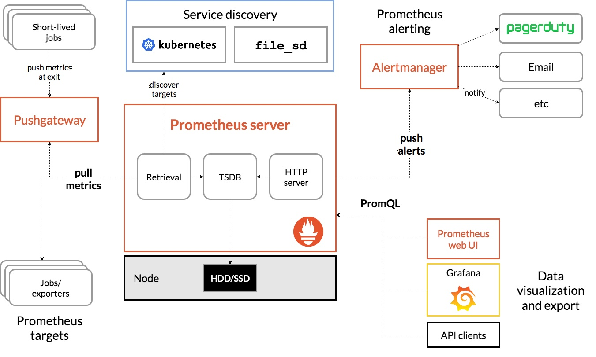
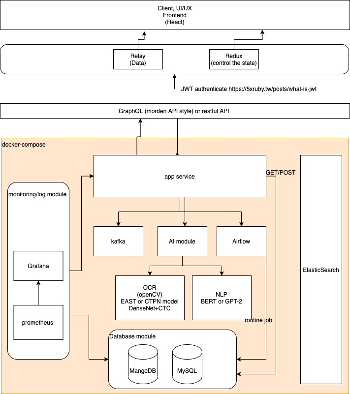
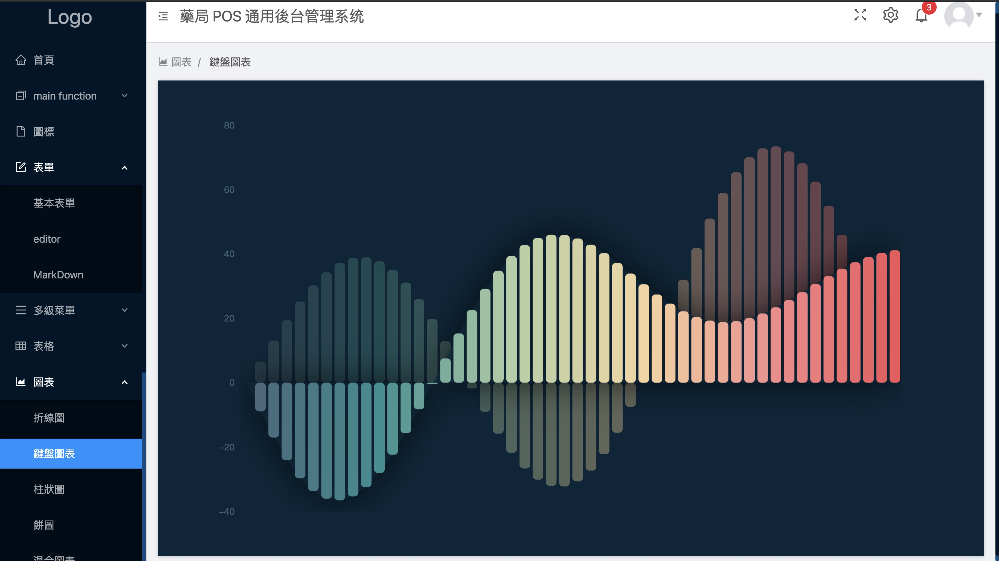
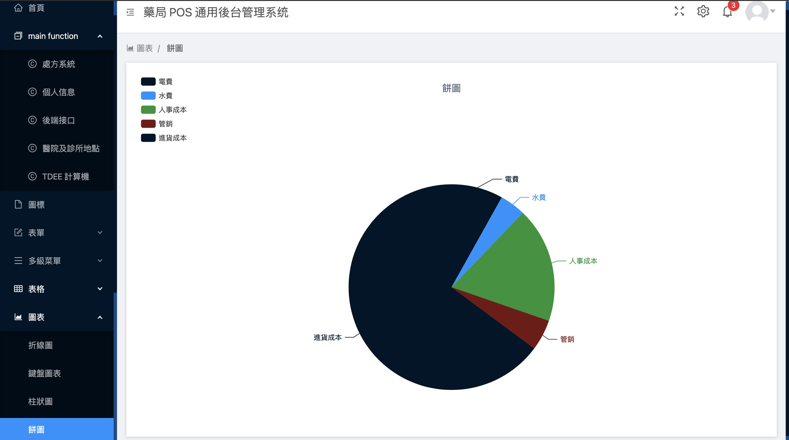

# pharmX

## Introduction:

​	This project's goal is going to build a platform for pharmacists, retail pharmacies, drug wholesale, and others. The system can deal with drug logistics, prescription issues, drug consultation. The first goal is going to make drug administration more fluent and efficient. The system can work on all platforms, the framework of the frontend is react with Antd which is enterprise-level React UI. Backend combines multi-service to ensure the robustness of the system. Include, Redis as cache. Prometheus and grafana for monitoring and alarm job. The database uses NoSQL database MongoDB and SQL database.

## Architecture Description:





## Quick View






## Module need to Integrate:

#### Frontend:

* React
* [Axios](https://bestofjs.org/projects/axios)-Promise based HTTP client for the browser and node.js
* [Hyperformula](HyperFormula)-HyperFormula is an open-source calculation engine that allows you to perform Excel-like calculations in your business applications. 
* Antd-UI
* Material-UI
*  [React-use](https://github.com/streamich/react-use) - react hook library
* [Echart](https://bestofjs.org/projects/echarts) -A powerful, interactive charting and data visualization library for browser
* jQuery
* Device.js: Used to determine which device the user is currently using, and provide multiple devices for you to judge. I often use this small tool to judge the device.
* Aos.js: Use the simplest parallax scrolling kit, built-in multiple animation modes, as long as the corresponding html tag writes the animation mode, you can quickly complete the parallax scrolling web page.Animated-scroll-to: What if you want to use animate scrollTop after abandoning jquery? Animated-scroll-to is to replace this feature, so you might as well give it a try, it's much simpler than jquery.
* Swiper.js: You can quickly complete the slideshow effect on the page without relying on jquery. A large number of APIs and detailed files can meet all your needs. I have not encountered anything that it can't do. It supports RWD, which is super good. use.
* Webpack: At present, the automation tool with the highest market share in the industry, whether it is compilation or packaging or server service, it can be said to be quite comprehensive. The only difference is that its entry barrier is relatively high. The configuration of webpack needs to be converted through the loader tool, and then through Simple regular expressions to configure, you may feel that it is not convenient for gulp at the beginning, but when you get used to using WebPack, you will find that many things are really convenient. I currently use WebPack, which is more and more used to complete the project. When you have to write each command yourself, the WebPack configuration method I prefer, but for large projects, it must be WebPack.

### backend

AI OCR module: db+PGNet+CRNN [ref](https://github.com/PaddlePaddle/PaddleOCR) 

## Deploy the project:

### Start backend 

```bash
docker-compose up --build -d <service_name>
```

### Start frontend

```bash
docker build -t sample:dev .  # rebuild image
```

```bash
docker run \ 
    -it \
    --rm \
    -v ${PWD}:/app \
    -v /app/node_modules \
    -p 3001:3000 \
    -e CHOKIDAR_USEPOLLING=true \
    sample:dev
```

