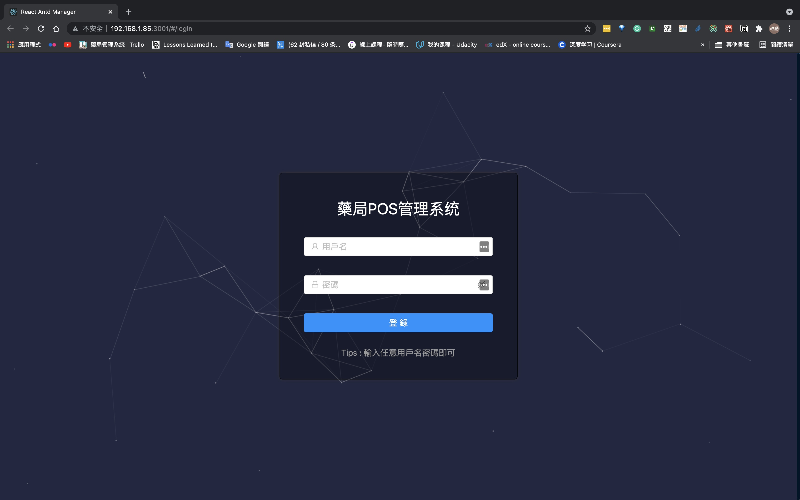

# pharmX

## Introduction:

​	This project's goal is going to build a platform for pharmacists, retail pharmacies, drug wholesale, and others. The system can deal with drug logistics, prescription issues, drug consultation. The first goal is going to make drug administration more fluent and efficient. The system can work on all platforms, the framework of the frontend is react with Antd which is enterprise-level React UI. Backend combines multi-service to ensure the robustness of the system. Include, Redis as cache. Prometheus and grafana for monitoring and alarm job. The database uses NoSQL database MongoDB and SQL database.

## Architecture Description:


## Quick View




## Module need to Integrate:

#### Frontend:

* React
* [Axios](https://bestofjs.org/projects/axios)-Promise based HTTP client for the browser and node.js
* [Hyperformula](HyperFormula)-HyperFormula is an open-source calculation engine that allows you to perform Excel-like calculations in your business applications. 
* Antd-UI
* Material-UI
*  [React-use](https://github.com/streamich/react-use) - react hook library
* [Echart](https://bestofjs.org/projects/echarts) -A powerful, interactive charting and data visualization library for browser
* jQuery
* Device.js：用來判斷使用者目前所使用的裝置是哪一個，提供多種裝置給你判斷，判斷裝置我常常用這個小工具去判斷
* Aos.js：使用最簡單的視差滾動套件，內建超多種動畫模式，只要相對應的html標籤寫上動畫模式，就可以迅速完成視差滾動網頁。
* Animated-scroll-to：捨棄jquery後如果想要用animate scrollTop怎麼辦？Animated-scroll-to就是來取代這個功能的，不妨試試看吧，比jquery簡單多了。
* Swiper.js：可以完全不依賴jquery就可以快速在頁面上完成幻燈片效果，大量的api跟詳細的文件，可以滿足你所有的需求，目前沒遇過它做不到的，支援RWD，超好用的。
* Webpack：目前業界市佔率最高的自動化工具，不管是編譯或是打包還是服務器服務，可以說是相當全面，唯一不同的是它的入門門檻比較高，webpack的配置要透過loader工具轉換，再透過簡單的正則表達式去配置，一開始接觸可能會覺得沒有gulp方便，可是當WebPack使用習慣後會發現很多東西真的非常方便，我目前使用比較多也是用的WebPack來完成專案，反倒是因為每個指令都要自己寫的情況下，我比較喜歡的WebPack配置方式，大專案來說一定非的WebPack莫屬。

## Deploy the project:

### Start backend 

```bash
docker-compose up --build -d <service_name>
```

### Start frontend

```bash
docker build -t sample:dev .  # rebuild image
```

```bash
docker run \ 
    -it \
    --rm \
    -v ${PWD}:/app \
    -v /app/node_modules \
    -p 3001:3000 \
    -e CHOKIDAR_USEPOLLING=true \
    sample:dev
```

